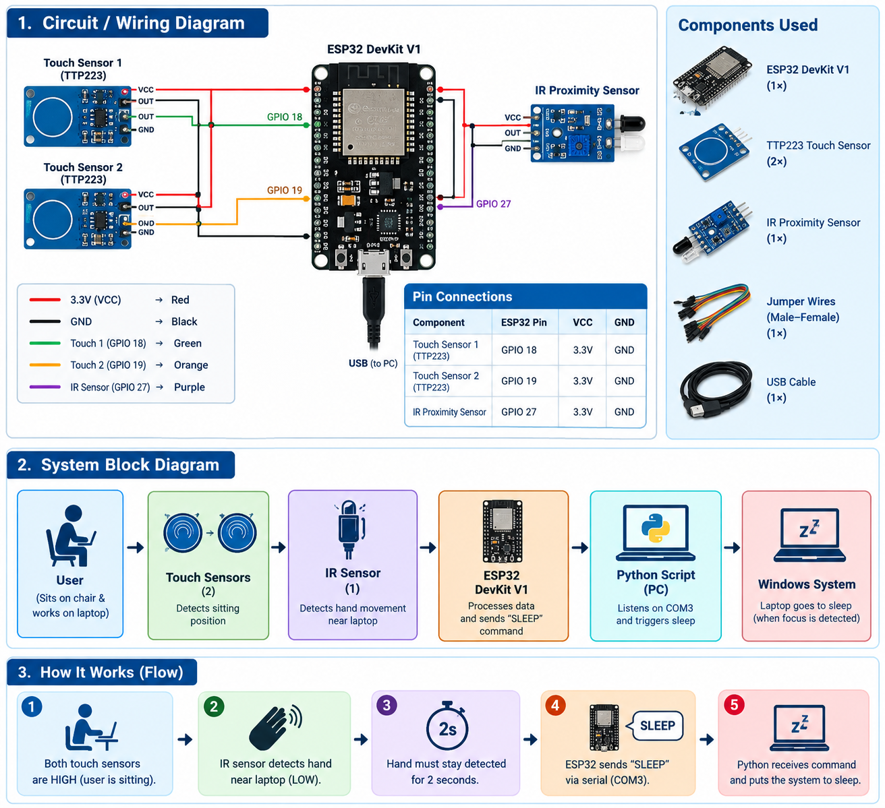
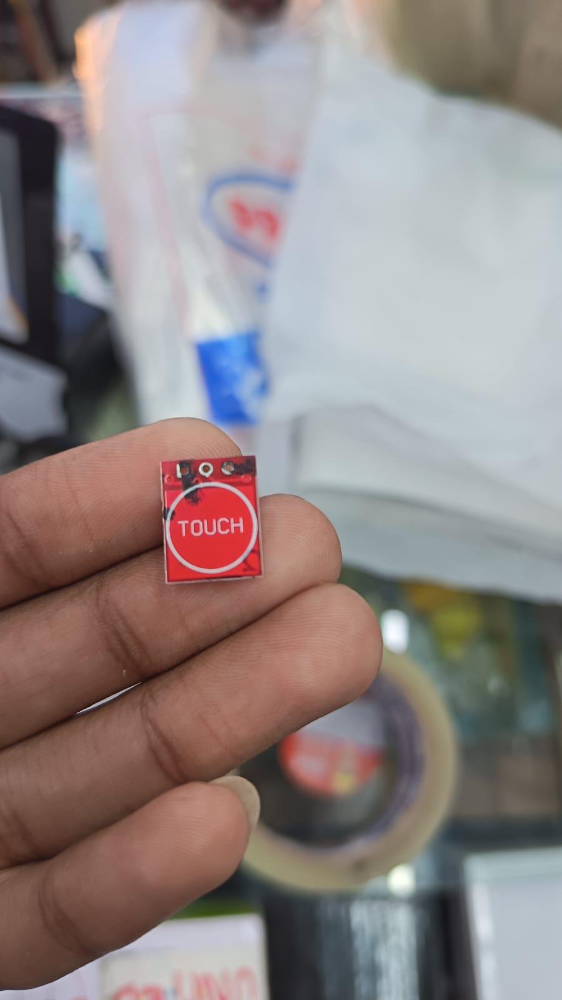
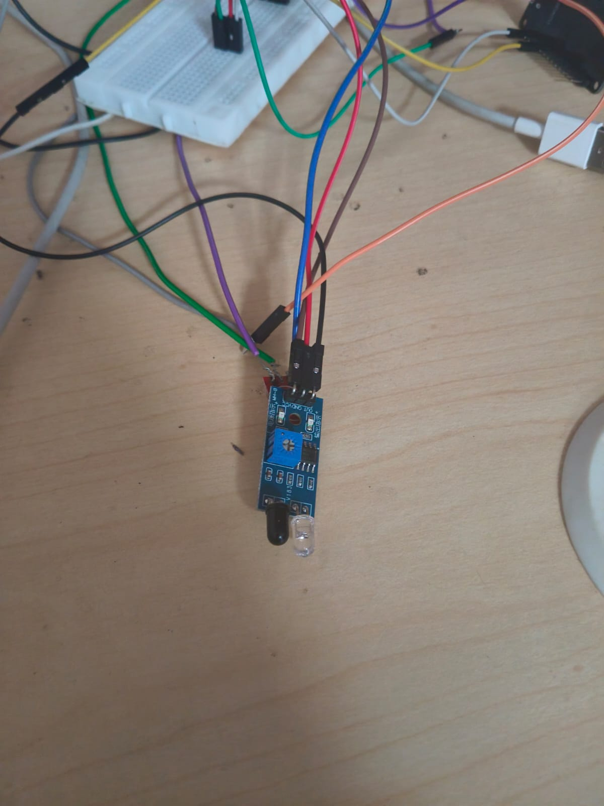
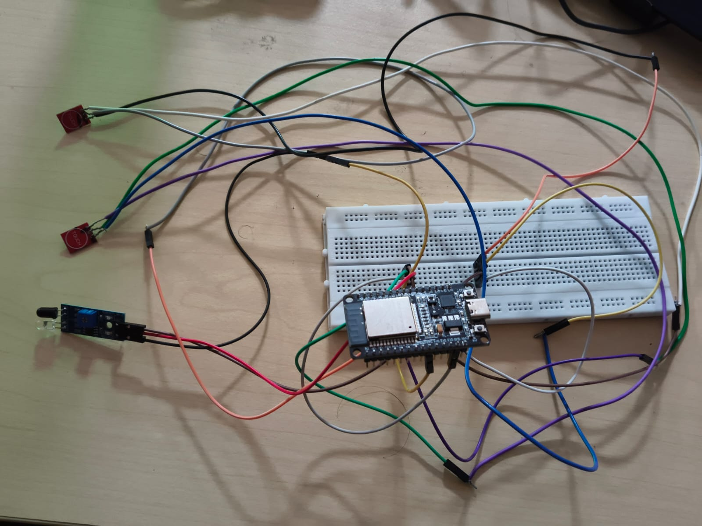

# [എന്നാ നീ ഇപ്പോ പണിയണ്ട] 🎯

## Basic Details
### TEAM lead Name: [UNNIKRISHNAN NAMBOOTHIRI EN]

### Project Description
["എന്നാ നീ ഇപ്പോ പണിയണ്ട"is a fun hardware project designed to do the exact opposite of a productivity system. It detects when a person is sitting and trying to work on their computer, then automatically turns off the system when they try to work. Using an ESP32, touch sensors, and an IR sensor, creates a humorous and frustrating experience where the harder you try to focus, the faster it stops you! ]

### The Problem (that doesn't exist)
[There is nobody to stop you from working, eveyone force you to work.. where എന്നാ നീ ഇപ്പോ പണിയണ്ട force you not to work ]

### The Solution (that nobody asked for)
[TURN OFF YOUR COMPUTER WHENEVER YOU TRY TO WORK]

## Technical Details
### Technologies/Components Used
For Software:
- [Languages used: C/C++ (ESP32 Arduino code), Python]
- [TOOLS: Arduino IDE, Python, Windows Command Prompt/Terminal]

For Hardware:
- [ESP32 DevKit V1, 2× TTP223 Touch Sensors, IR Proximity Sensor, USB Cable, Jumper Wires]
- [ESP32 3.3V logic, Touch sensor digital output, IR sensor for hand/object detection, USB serial communication at 115200 baud]
- [Arduino IDE, USB cable, Breadboard, Jumper wires]

### Implementation
For Software:

# Run
[PYTHON focusguard.py]

For Hardware:

# Schematic & Circuit

# Build Photos

*Touch sensor*

*IR SENSOR*

*IR,TOUCH SENSOR CONNECTED WITH ESP32 *

### Project Demo
# Video

https://github.com/user-attachments/assets/b836036c-fd22-4f4e-98e6-5902363e7910

Made with ❤️ at TinkerHub Useless Projects 

